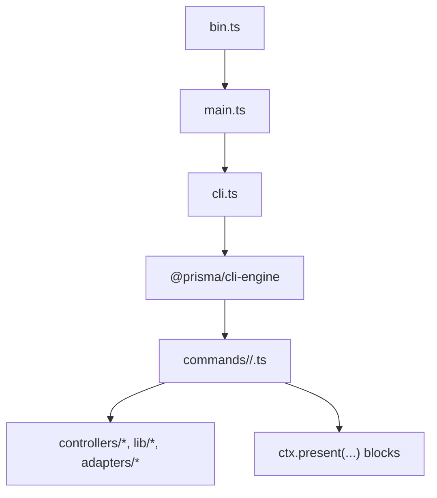

# Prisma CLI Architecture Overview

The Prisma CLI is the future unified command-line interface for Prisma. The
current implementation focuses on app workflows, but the command model must keep
room for schema, database, and migration workflows.

Product behavior lives in [docs/product](../product). This document explains how
the implementation is organized so contributors know where changes belong.

## Architecture At A Glance

## Command Flow

1. `packages/cli/src/bin.ts` starts the Node process and calls `main`.
2. `packages/cli/src/main.ts` builds the CLI, runs the update check, and
   hands the engine a runtime assembled from `process`.
3. `packages/cli/src/cli.ts` mounts every command and command family.
4. The engine parses argv, decides interactivity and credentials, dispatches
   the handler, and renders its result.
5. `commands/<group>/<command>.ts` defines one command: its flags, its help, and a
   handler that returns a presented result.
6. `controllers/*`, `lib/*`, and `adapters/*` are the operation layer: project
   resolution, environment variables, local state, and platform API calls.
7. Handlers describe output as presentation blocks; the engine owns the bytes.

## Contributor Boundaries

- Command files should describe the CLI grammar, not own product behavior.
- Handlers should orchestrate one command path and stay thin.
- Adapters and client modules should own filesystem, state, auth, and platform
  boundaries.
- The engine owns terminal and JSON rendering; handlers describe blocks.

When behavior is unclear, update the relevant product doc before changing code.

## Provider And Client Boundaries

Remote platform access should stay behind adapter or client modules. Command
definitions and handlers should not depend on a concrete provider
implementation.

Local state boundaries are also explicit:

- `.prisma/local.json` stores the linked project id (a gitignored local pin, not a committed config file).
- Active branch and app selection are local CLI state.
- Secret values must not be printed in human output or structured output.

## Public Beta Constraints

The beta package should remain small and predictable:

- The implemented command groups are `auth`, `project`, `branch`, and `app`.
- The CLI must not introduce product-specific namespaces.
- `local` is local CLI context only, not a branch or deploy target.
- `production` is a protected durable branch and requires explicit intent.
- Every other named branch is preview by default.

See [resource model](../product/resource-model.md) and
[command spec](../product/command-spec.md) for the authoritative rules.
