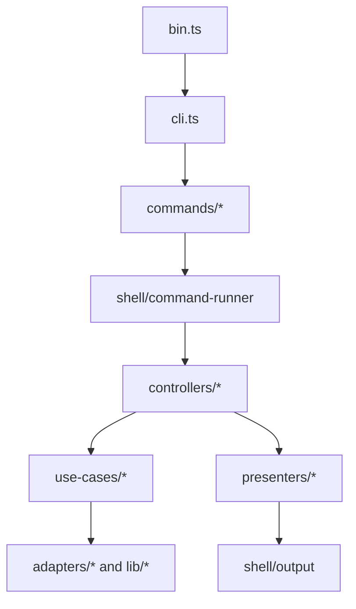

# Prisma CLI Architecture Overview

The Prisma CLI is the future unified command-line interface for Prisma. The
current implementation focuses on app workflows, but the command model must keep
room for schema, database, and migration workflows.

Product behavior lives in [docs/product](../product). This document explains how
the implementation is organized so contributors know where changes belong.

## Architecture At A Glance

## Command Flow

1. `packages/cli/src/bin.ts` starts the Node process and calls the CLI runner.
2. `packages/cli/src/cli.ts` assembles the Commander program and attaches command
   groups.
3. `commands/*` defines command names, arguments, flags, and help text.
4. `shell/*` creates command context, parses global flags, handles prompts,
   output streams, and error rendering.
5. `controllers/*` translate CLI inputs into application operations.
6. `use-cases/*` hold product rules such as project resolution, auth behavior,
   and branch targeting.
7. `adapters/*` and feature `lib/*` modules isolate local state, config, auth,
   and platform-facing operations.
8. `presenters/*` convert command results into human and structured output.

## Contributor Boundaries

- Command files should describe the CLI grammar, not own product behavior.
- Controllers should orchestrate one command path and stay thin.
- Use cases should enforce documented product rules.
- Adapters and client modules should own filesystem, state, auth, and platform
  boundaries.
- Presenters and shell output helpers should own terminal and JSON rendering.

When behavior is unclear, update the relevant product doc before changing code.

## Provider And Client Boundaries

Remote platform access should stay behind adapter or client modules. Command
definitions, controllers, and presenters should not depend on a concrete
provider implementation.

Local state boundaries are also explicit:

- `prisma.config.ts` stores the linked project id.
- Active branch and app selection are local CLI state.
- Secret values must not be printed in human output or structured output.

## Public Preview Constraints

The preview package should remain small and predictable:

- The implemented command groups are `auth`, `project`, `branch`, and `app`.
- The CLI must not introduce product-specific namespaces.
- `local` is local CLI context only, not a branch or deploy target.
- `production` is a protected durable branch and requires explicit intent.
- Every other named branch is preview by default.

See [resource model](../product/resource-model.md) and
[command spec](../product/command-spec.md) for the authoritative rules.
